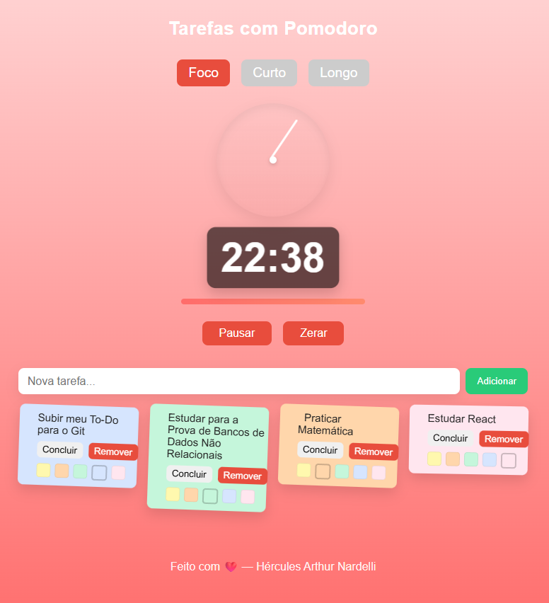
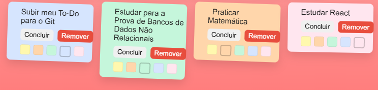

🛠️ Sobre este projeto

Este projeto é 100% sem fins lucrativos.
Foi criado apenas para aprender, treinar e praticar conceitos de programação, design e usabilidade.

⏱️ Pomodoro Project

Bem-vindo ao Pomodoro Project! 🎉
Aqui você encontra uma forma simples e divertida de aplicar o famoso Método Pomodoro, criado por Francesco Cirillo lá nos anos 80.
A ideia é alternar ciclos de 25 minutos de foco total com pausas estratégicas, ajudando você a ser mais produtivo sem fritar a cabeça.

🍅 Como funciona?

Escolha uma tarefa.

Clique no relógio e trabalhe 25 minutos sem distrações.

Faça uma pausa curta de 5 minutos.

Repita o processo.

Depois de 4 ciclos, faça uma pausa longa (15 a 30 min).

É simples, mas poderoso! ⚡

👨‍💻 Contribua!

Quer deixar esse projeto ainda mais legal?
Dá um fork, manda um pull request ou abre uma issue com sua ideia. Vamos construir juntos 🍅